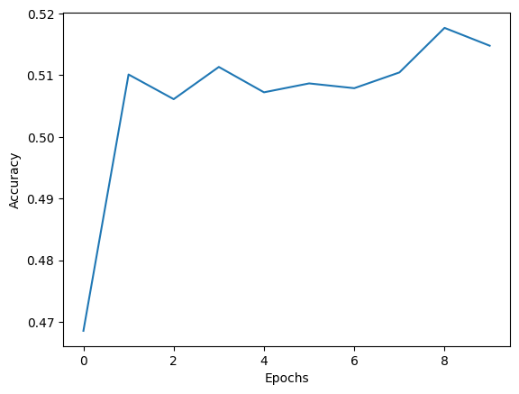

<!--
 * @Author: hibana2077 hibana2077@gmail.com
 * @Date: 2024-05-16 22:56:10
 * @LastEditors: hibana2077 hibana2077@gmail.com
 * @LastEditTime: 2024-05-17 11:52:21
 * @FilePath: \Encoder-Decoder-time-series-predit-model\README.md
 * @Description: 这是默认设置,请设置`customMade`, 打开koroFileHeader查看配置 进行设置: https://github.com/OBKoro1/koro1FileHeader/wiki/%E9%85%8D%E7%BD%AE
-->
# Stock Price Movement Prediction Model Based on LSTM Autoencoder

<p align="center">
    <br>
</p>

## Table of Contents

- [Abstract](#abstract)
- [Results](#results)
- [Conclusion](#conclusion)
- [Run](#run)

## Abstract

In this study, we propose a novel approach for predicting stock price movements using an LSTM-based Autoencoder model. Initially, we train an autoencoder where both the input and output are the relative price changes over a given time interval, denoted as ΔT. The LSTM autoencoder is designed to capture the temporal dependencies in stock price fluctuations. Upon successful training, the autoencoder parameters are frozen to preserve the learned temporal representations. Subsequently, we augment this model by adding five fully connected (dense) layers to function as a classifier, which is then trained to enhance predictive accuracy.

The LSTM autoencoder consists of an encoder $E(x_t)$ and a decoder $D(y_t)$, where $x_t$ and $y_t$ represent the relative price changes over ΔT at time $t$. The objective is to minimize the reconstruction loss 

$$ L_{rec} = \| x_t - D(E(x_t)) \|^2 $$

ensuring the encoder learns a compact representation $z_t = E(x_t)$. The encoder is composed of LSTM units, formulated as:

$h_t = \text{LSTM}(x_t, h_{t-1}, c_{t-1}),$

where $h_t$ denotes the hidden state and $c_t$ the cell state at time $t$.

In the classifier stage, the frozen autoencoder outputs $z_t$ are fed into the dense layers, trained with a cross-entropy loss 

$L_{cls} = -\sum y_i \log \hat{y}_i,$

where $y_i$ and $\hat{y}_i$ represent the true and predicted class labels respectively. This two-stage training approach leverages the robust feature extraction capabilities of the LSTM autoencoder and refines the predictions through additional classification layers.

Our experimental results demonstrate that this model significantly improves the accuracy of stock price movement predictions, validating the effectiveness of incorporating LSTM autoencoders in financial time series analysis.

## Results

The proposed model was evaluated on a dataset of stock prices, and the performance was measured using accuracy and loss metrics. The architecture of the model is as follows:

```
TimeSeriesPredictor(
  (encoder): TimeSeriesEncoder(
    (lstm1): LSTM(5, 64)
    (conv1): Conv1d(64, 32, kernel_size=(1,), stride=(1,))
    (lstm2): LSTM(32, 4)
  )
  (predictor): Linear(in_features=4, out_features=3, bias=True)
)
```

The accuracy and loss metrics were recorded over multiple epochs, with the accuracy reaching a maximum of 0.52 and the loss decreasing to a minimum of 0.70026. The loss function used in the training was cross-entropy. The accuracy and loss trends over the training epochs are illustrated in the figures below.


*Figure 1: Accuracy over epochs*


*Figure 2: Loss over epochs*

The accuracy plot (Figure 1) shows a steady increase in performance, peaking at 0.52. The loss plot (Figure 2) indicates a significant reduction in the initial epochs, stabilizing around 0.70026. These results demonstrate the effectiveness of the LSTM autoencoder in capturing temporal dependencies in stock price data, and the subsequent classifier layers improve the overall prediction performance.

## Conclusion

Although the results achieved in this study were not ideal, our findings suggest that the approach of using transfer learning with an LSTM-based autoencoder model has significant potential for improvement in stock price movement prediction. The architecture, which initially trains an autoencoder to capture the temporal dependencies in stock price data and subsequently fine-tunes the model with additional classifier layers, demonstrates a promising direction. Future work can explore optimizing the model parameters, incorporating more sophisticated attention mechanisms, and leveraging larger and more diverse datasets to enhance prediction accuracy and robustness. This study highlights the viability of transfer learning and the LSTM autoencoder framework as a foundation for further advancements in financial time series analysis.

## Run

To run the code, follow these steps:

1. Clone the repository:

```bash
git clone
```

2. Install the required dependencies:

```bash
pip install -r requirements.txt
```

3. train the model in jupyter notebook


## License

This project is licensed under the MIT License - see the [LICENSE](LICENSE) file for details.
